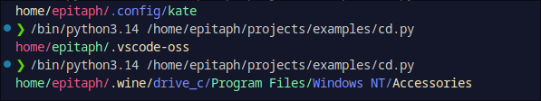

  
    
  <kbd>
    
  </kbd>
  &nbsp;&nbsp;
  <kbd>
    
  </kbd>
  &nbsp;&nbsp;
  <kbd>
    
  </kbd>

<h1 align="center">Color Print (PrintC)</h1>

<b>This is a library that allows you to output colored notifications to the console</b>

> [!Warning]\
> For the library to function correctly, a terminal that supports a color display is required!

> [!Tip]\
> You can use this with logger,
> you can also take {er} as a basis and create your own colored messages for the logger

<h1 align="center">Image Gallery</h1>

Click to open/close gallery

  &nbsp;&nbsp;
  

    
  

  &nbsp;&nbsp;
  

    
  

  &nbsp;&nbsp;
  

    
  

<h1 align="center">Color Syntax Guide</h1>

Click to open/close syntax guide

  &nbsp;&nbsp;
  

    <h3>Basic Color Tags</h3>
    

    <code>{re}</code> - Red text 
    <code>{yl}</code> - Yellow text 
    <code>{gr}</code> - Green text 
    <code>{bl}</code> - Blue text 
    <code>{rs}</code> - Reset color (return to default)
  

  &nbsp;&nbsp;
  

    <h3>Error Format</h3>
    

    <code>{er}</code> - Formats an error message in red with [ERROR] prefix
  

  &nbsp;&nbsp;
  

    <h3>Usage Examples</h3>
    

    
    <code>printc("{gr}Success!{rs}")</code>
      
    <code>printc("{re}Warning: {yl}Low disk space{rs}")</code>
      
    <code>printc("{er}", "File not found")</code>
  

